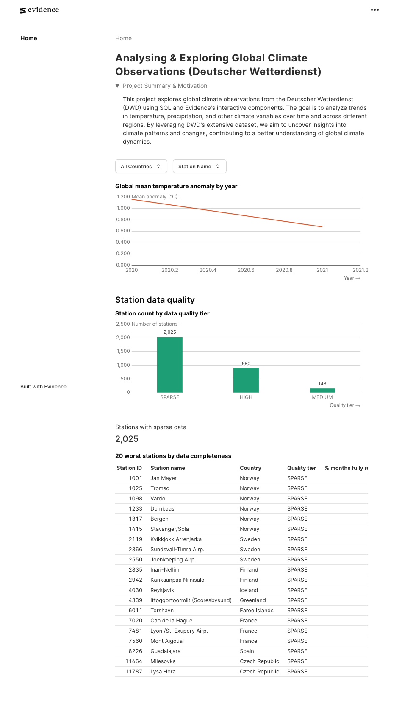

<div align="center">

# ☁️ Analysing Global Climate & Weather Observations

**An end-to-end data pipeline that ingests data from Deutsche Wetterdienst (DWD)'s publicly available monthly climate observations and transforms it into analysis ready tables which are then visualised into a report.**

  

[Report Bug](https://github.com/kabirhalai/cdc-weather-observations/issues) 

</div>

----------

## 📸 Dashboard

When run for years 2020 to 2021:



----------

## 📖 About

This project extracts open-source data from the Deutsche Wetterdienst (German Weather Service)'s open data server, ingests it, transforms it, and visualises it in a dashboard. The problem it solves is to make the data more accessible and easier to analyse for anyone interested in exploring global climate and weather observations.The data is also quite messy and difficult to work with for example, each file has dozens of columns with each subsection corresponding to a section. See [the provided](https://opendata.dwd.de/climate_environment/CDC/observations_global/CLIMAT/monthly/raw/readme_RAW_CLIMATs_eng.txt) data dictionary for more details.

This is an end-to-end data project built to qualify as a capstone project for the amazing Data Engineering Zoomcamp and also serves as a portfolio project.  I want to orient my career as a data engineer around building robust data solutions while creating impact in important domains like climate and energy. Hence, when the opportunity to build a project arose, I chose to work with climate data to further broaden my understanding of it.

### Pipeline Details & Steps
- Python scripts carry out the following:
  - Download raw monthly climate and weather observations from stations positioned globally for a designated range of years. Due to the size of the files, the raw files are simply stored in to the local filesystem (treated as a data lake).

  - Break up all the files into section wise chunks as per the data dictionary and clump all the section files into one big parquet file for each section. These parquet files are also stored locally along with being loaded into a local DuckDB file for transformation. 
- The data is then transformed using dbt while following the medallion architecture. The staging and intermediate stages are stored as views while storing marts as tables ready for analysis which is dashboarded using [Evidence](https://evidence.dev/). 

- The pipeline's extraction and transformation tasks are orchestrated using [Prefect](https://www.prefect.io/).
- The whole pipeline is containerised end-to-end with Docker. Some inital steps are further orchestrated and simplified using Make commands.


### Learnings from the project
- Data's formatting is weird since its WMO CLIMAT code, designed for: 
    - Telecommunication efficiency (old-school weather transmission)
    - Fixed-width encoding
    - Sequential parsing
- DWD also makes the data schema and dictionary for the raw data files that this project ingests available as a file on their opendata platform. I iterated over and wrote a script to convert that data dictionary into a sources.yaml file for dbt to use as source definitions which was a fun little exercise in data parsing and transformation. This also means that if the data schema changes in the future, all I need to do is re-run that script with the new data dictionary and the sources will be updated accordingly.

- I initially had a lot of plans for extensive analysis but due to the messiness of the data and time constraints, I focused on shipping an MVP first.

- Got to learn and work with some new tools like Evidence and Prefect which was a lot of fun. I also got to practice my Docker skills by containerising the whole project end-to-end. Also got to practice writing dbt models.


----------
## ✨ Features

-   **Set up scheduled ingestion with Prefect** — Pipeline sets up a Prefect server for you to schedule the pipeline to run at a regular cadence.
-   **Ease of analysis with Evidence** — Evidence brings Markdown and SQL hand-in-hand for creating documents with explanation and analysis baked in.
- **Easily set up** — Make commands make setting up easy simple.

----------

## 🛠️ Built With
|Category| Technology |
|--|--|
|Data Ingestion|Python|
|Orchestration|Prefect|
|Data Transformation|dbt|
|Data Visualisation|Evidence|
|Warehouse|DuckDB|

----------

## 🚀 Getting Started

### Prerequisites

Docker Desktop

### Installation

1.  **Clone the repository**
    
    ```bash
    git clone https://github.com/kabirhalai/cdc-weather-observations
    ```
    
2.  **Change directory**
    
    ```bash
    cd cdc-weather-observations    
    ```
    
3.  **Run project**

    > [!CAUTION] Please use years between 2003 and the current year since the data is only available for that range. Also, make sure to have enough disk space since the raw files collectively can take some space for a long year range and the project stores all intermediate files locally as well.
    
    ```bash
    make clean && make project START_YEAR=2021 END_YEAR=2023 # you can change accordingly
    ```

4.  **Run Evidence dashboard**
    
    ```bash
    make dashboard
    ```
5.  **Run Prefect dashboard**
    
    ```bash
    make prefect-server
    ```

----------

## 📁 Project Structure

```
project-name/
├── src/
│   ├── components/     # Reusable UI components
│   ├── pages/          # Page-level components / routes
│   ├── hooks/          # Custom React hooks
│   ├── utils/          # Helper functions
│   └── types/          # TypeScript type definitions
├── public/             # Static assets
├── tests/              # Test files
├── .env.example        # Environment variable template
└── README.md

```
----------

## 🗺️ Roadmap
This is only an MVP version of the project whose scope was reduced based on available time. The plan is to add more testing, more meaningful analyses, and guardrails for bad/inconsistent data.

----------

## 🤝 Contributing

Contributions are welcome! Here's how:

1.  Fork the repository
2.  Create a feature branch (`git checkout -b feature/amazing-feature`)
3.  Commit your changes (`git commit -m 'Add amazing feature'`)
4.  Push to the branch (`git push origin feature/amazing-feature`)
5.  Open a Pull Request

----------

## 📄 License

Distributed under the MIT License. See `LICENSE` for details.

----------

## 👤 Author

**Your Name**


-   GitHub: [@kabirhalai](https://github.com/kabirhalai)
-   LinkedIn: [linkedin.com/in/kabir-lohana](https://www.linkedin.com/in/kabir-lohana/)

----------

## 🙏 Acknowledgements
A huge thank you to code assistance and coding agent tools like GitHub Copilot and Claude Code for serving and guiding me through the project and helping whenever I needed it.

----------

<div align="center"> <sub>Built with ❤️ by <a href="https://github.com/kabirhalai">Kabir</a></sub> </div>
